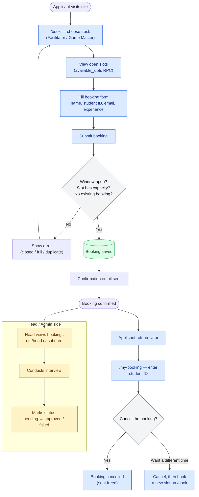
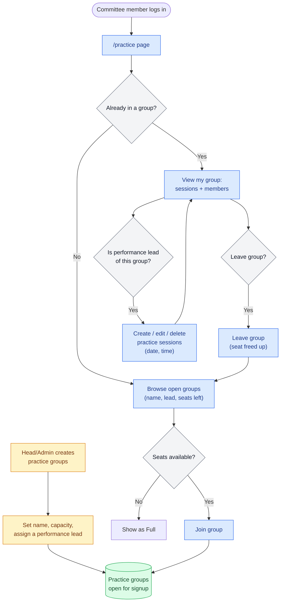

# XMUM Orientation — Interview Slot Booking

Two-sided interview booking for the **Head of Facilitators** and **Head of Game Masters**.
Heads open interview availability; applicants self-book. Two independent tracks
(Facilitator / Game Master). Built as the first module of the wider Orientation platform.

- **Spec:** [docs/superpowers/specs/2026-06-22-interview-booking-design.md](docs/superpowers/specs/2026-06-22-interview-booking-design.md)
- **Plan:** [docs/superpowers/plans/2026-06-22-interview-booking.md](docs/superpowers/plans/2026-06-22-interview-booking.md)

## Tech stack

Next.js 16 (App Router, TypeScript) · Tailwind v4 + shadcn/ui · Supabase (Postgres + Auth) ·
Vitest. Booking concurrency is enforced in Postgres via a locking RPC (`book_slot`), so a
slot can never be overbooked.

## Role-Based Access Control

### Interview booking

| Role | Account? | Primary route | Key permissions | Scope |
|---|---|---|---|---|
| Interviewee | No account | `/book`, `/my-booking` | Book a slot; look up and cancel own booking by Student ID (to move slots: cancel, then book again) | Own booking only |
| `head_facilitator` / `head_gm` | Login required | `/head` | Manage slots, booking window, bookings, interview status/notes, cancel bookings; bulk-invite approved interviewees onto the committee | Own track only (+ own orientation/year if set) |
| `admin` | Login required | `/head`, `/admin` | Everything Heads can do, unscoped, plus invite Head/Admin accounts | Both tracks, all orientations |

### Performance practice

| Role | Account? | Primary route | Key permissions | Scope |
|---|---|---|---|---|
| `committee` | Login required | `/practice` | Join/leave a practice group; view own group's members and sessions | Own group only |
| `performance_lead` | Login required | `/practice` | Everything `committee` can do, plus edit own group's name/capacity and create/edit/delete its practice sessions | Own group only |
| `head_facilitator` / `head_gm` | Login required | `/practice` | Same as `committee` (or `performance_lead` if they lead a group) — HOF/HOG carries no extra practice privileges; no visibility into other groups or their members | Own group only |
| `admin` | Login required | `/head/practice` | View all groups and their members; create/rename/delete groups, reassign leads, and assign committee positions (HOF/HOG etc.) | Both tracks, all orientations |

Interviewees do **not** log in — booking, lookup, and cancellation all run through public,
Student-ID-scoped functions. Only committee/staff have accounts; new staff profiles start
as a placeholder `applicant` role until a Head or Admin assigns their real role. At most one
active booking per applicant per track. Practice group governance and cross-group visibility
(view all groups or any group's members; create/rename/delete a group;
reassign its lead) is admin-only. HOF/HOG grants real `/head` dashboard access for interview
booking (see above) but, for the practice-group feature specifically, is purely a cosmetic
committee position — a HOF/HOG account uses `/practice` exactly like any other committee
member.

## Routes

- `/book` — public, no login: track tabs → pick a slot → enter details → confirmation
- `/my-booking` — public, no login: search active bookings by Student ID and cancel them if active
- `/login` — committee sign-in (Heads/Admin)
- `/register` — committee activation: a pre-invited committee member sets a password (email + invite code)
- `/head` — Committee dashboard (admin/Heads)
- `/admin` — admin-only: invite committee (name, student ID, email, role) and view invite codes/status

## Staff onboarding

Two ways to create staff accounts:

1. **Seed** (initial admin + heads): `npm run seed` — see below.
2. **In-app invites** (admin self-service): an admin goes to `/admin`, adds a staffer
   (name, student ID, email, role) → the system generates an **invite code**. The admin
   shares the email + code with the staffer, who activates their account at `/register` by
   setting a password. The claim runs server-side (`app/api/staff/register`, service-role
   key) and assigns the invited role. Invite codes guard against anyone claiming an account
   they weren't invited to.

## Local development

```bash
npm install
cp .env.local.example .env.local   # then fill in the values below
npm run dev                        # http://localhost:3000
npm test                           # unit tests (DB tests auto-skip without env)
npm run build && npm run lint
npm run migrate                    # apply any un-applied SQL migrations (needs SUPABASE_DB_URL)
npm run build:migrations           # regenerate supabase/all_migrations.sql from migrations/
```

`.env.local`:

```
NEXT_PUBLIC_SUPABASE_URL=your-supabase-project-url
NEXT_PUBLIC_SUPABASE_ANON_KEY=your-supabase-anon-key
SUPABASE_SERVICE_ROLE_KEY=your-supabase-service-role-key # Keep secret, never expose to browser

# Canonical site URL used to build links in outbound emails (invite
# activation, etc). Without this, links fall back to whatever Host header
# the server action happens to run behind — e.g. localhost:3000 if triggered
# from a local dev server — which is wrong for anything mailed to a real
# applicant/staffer. Set this to the deployed URL below.
SITE_URL=https://xmum-ori-interview.vercel.app

# SMTP Email Configuration (Nodemailer)
SMTP_HOST=smtp.gmail.com
SMTP_PORT=587
SMTP_USER=your-email@gmail.com
SMTP_PASSWORD=your-app-password
SMTP_FROM="XMUM Orientation Committee" <your-email@gmail.com>
```

## Wiring up Supabase & Setup

Follow these simple steps to hook up your own Supabase project:

1. **Create a Supabase Project**: Create a new project at [supabase.com](https://supabase.com).
2. **Setup Credentials**: Copy the URL, the `anon` key, and the `service_role` key from your Supabase Dashboard (Project Settings -> API) and paste them into your `.env.local`.
3. **Configure Email SMTP**: Set up your email transporter variables in `.env.local`. If using Gmail, generate an **App Password** in your Google Account security settings.
4. **Apply SQL Migrations** — either way works:
   - **From the dashboard (fresh database):** open **SQL Editor**, paste the whole of
     [supabase/all_migrations.sql](supabase/all_migrations.sql), and **Run**. This builds the
     tables, RLS policies, views, triggers, and RPCs.
   - **From your terminal (fresh *or* existing database):** add `SUPABASE_DB_URL` to
     `.env.local` (Project Settings → Database → Connection string → URI) and run
     `npm run migrate`. It applies only the migrations that haven't run yet, tracked in a
     `_schema_migrations` table, so it is the safe option for upgrading a live project.

   > `all_migrations.sql` is **generated** — it is every file in `supabase/migrations`
   > concatenated in order. After adding a migration, run `npm run build:migrations` to
   > rebuild it rather than editing it by hand.
5. **Seed the Committee Accounts**:
   Run the seed script in your terminal to initialize pre-confirmed Admin and Head accounts:
   ```bash
   npm run seed
   ```
6. **Run Integration Tests**:
   Ensure everything is communicating correctly with the DB:
   ```bash
   npm test
   ```

## Deploy (Vercel)

Live at **https://xmum-ori-interview.vercel.app**.

1. Push this repo to GitHub and import it at https://vercel.com.
2. Add the env vars (same as `.env.local`, including `SITE_URL` set to the deployed URL
   above) in the Vercel project settings.
3. Deploy. For the live recruitment window with ~250 concurrent users, consider
   temporarily upgrading Supabase to Pro for that period.

## Data model (summary)

- `profiles` — user (→ auth.users), name, student_id, email, role
- `slots` — track, starts_at, ends_at, capacity, status (open/closed)
- `bookings` — slot, applicant, track, status (booked/cancelled); partial unique index =
  one active booking per applicant per track
- `track_settings` — per-track booking window + reschedule cutoff

### Key RPCs

`book_slot` (locks the slot, checks window + capacity + one-per-track) ·
`cancel_booking_public` / `lookup_booking_public` (Student-ID-scoped, used by `/my-booking`) ·
`cancel_booking` / `reschedule_booking` (owner-checked, cutoff-gated — these require a
logged-in owner, so the public `/my-booking` flow does not expose reschedule) ·
`available_slots` (open future slots + seats-left, counts only) ·
`head_slots` / `head_bookings` (track-gated reads incl. applicant identity for Heads).

## Flowcharts

### Interview booking flow



### Practice group flow



## Core Features Built

- **Email notifications**: Confirmation email (sent via Nodemailer) after booking a slot,
  including the slot's venue. Sending is fire-and-forget — an SMTP failure is logged but never
  fails the booking, so check the server log if applicants report missing emails.
- **Venue on every slot**: set once per batch when creating slots (editable afterwards in the
  slots table); shown on `/book`, in the booking summary, on `/my-booking`, on the Head
  dashboard, and in the confirmation email.
- **Committee dashboard customizer**: Ability to customize and edit welcome email templates before bulk sending.
- **Interview outcome & notes**: Interactive evaluation notes field inside the candidate detail modal on `/head`.
- **Responsive design**: Supports mobile devices, tablets, and desktop computers (with collapsible forms and bottom-sheet drawers).
- **Self-service lookup & cancellation**: Public `/my-booking` route allows applicants to retrieve and cancel slots with case-insensitive student ID lookups.
